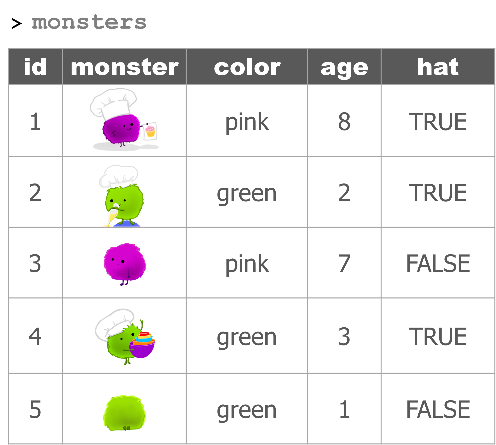

<style>
h1 .header-section-number {background: #031718;}
hr {background:  white;}
</style>


<link rel="stylesheet" 
href="https://cdnjs.cloudflare.com/ajax/libs/font-awesome/6.4.2/css/all.min.css">

```{r setup, include=FALSE}
knitr::opts_chunk$set(echo=TRUE, error=F, warning=F, color=NULL, message=FALSE, eval=F)

xaringanExtra::use_clipboard()
htmltools::tagList(rmarkdown::html_dependency_font_awesome())
```

<br>


# <i class="fa fa-video-camera"></i> <span style="font-size: 90%"> [Data wrangling](videos/day2/02-1-data-wrangling.html)

## <span class="teal">WRANGLE</span> <span style="color: gray">that DATA</span> {-}


<span class="hint float-right">Artwork by @allison_horst</spam>


## <i class="fa fa-toolbox blue"></i> Your data toolbox {-}

```{r child = '../../static/modules/dplyr/dplyr_toolbox/starter.Rmd', eval=T}
```


## Monsters are back {-}

```{r child = '../insert_monster_tabs_start.Rmd', eval=T}
```


```{r monster-tabs, results='asis', echo=F, eval=F}
cat(readLines("../insert_monster_tabs_start.R"))
```


## <i class="fas fa-bell blue" aria-hidden="true" style="margin-bottom: 12px;"></i> Our first order {-}

<style>
blockquote {background: #f8fdff; margin-top: 0;}
blockquote hr {margin-top: 6px; margin-left: 4px; background: lightgray; height: 1px;}
blockquote code {background: #f8fdff;}
</style>

> **`To:`** `Bot Bakery`  
> **`Subject:`** `Big treat order`  
> **`Attached:`** <i class="fas fa-paperclip" aria-hidden="true"></i><span class="bluecode">`crew_food_prefs.xlsx`</span>
> <hr>
> 
> Hi friend,
>
> Here's the table of my crew's goody preferences. 😋 
> 
> Guess which crewmate is me! 
>


## Get the data {-}

We can download the attached Excel file [HERE](https://tidy-mn.github.io/R-camp-penguins/data/crew_food_prefs.xlsx)

After you've downloaded the file, move the file from your *Downloads/* folder to a *data/* folder in your project's main directory:

1. Download the Excel file
2. Create a "data" folder in your project directory
  - You can do this the usual way with Windows Explorer, or use the built-in New Folder button in the RStudio `Files` pane.
3. Move the Excel file from your *Downloads/* folder to the new *data/* folder. 


## <i class="fas fa-file-excel" aria-hidden="true"></i> Excel in R {-}

Have an EXCEL file? The **readxl** package has the function `read_excel()` for reading Excel data into R.


### Let's install and load `readxl`: {-}

```{r, eval=F}
# Run the install line only one time to get the package
install.packages("readxl")

# Run this line every time you open R to load the package from your library
library(readxl)
```


### Now we can read in our Excel file: {-}
```{r, eval=F}
crew_df <- read_excel("data/crew_food_prefs.xlsx")
```

> Ope! What happened to our column names / headers?

<br>

```{r, eval=F}
crew_df <- read_excel("data/crew_food_prefs.xlsx", skip = 1)
```

<br>


> Having troubles loading the data? Here is an identical CSV version to load so you can carry on.

```{r}
crew_df <- read_csv("https://tidy-mn.github.io/R-camp-penguins/data/crew_food_prefs.csv")
```


<br>

### An Excellent alternative {-}

```{r fun-options, child='../../static/modules/readr/readr_csv/excel_csv.Rmd'}
```


## Glimpse the data {-}

```{r,eval=F}
head(crew_df)

glimpse(crew_df)

summary(crew_df)
```


## **`filter()`** to rows with missing values or NA's {-}

Use `filter()` to view the rows where `nut_allergy` is missing or is `NA`.

```{r}
filter(crew_df, is.na(nut_allergy))
```


## **`filter()`** out the test data {-}

There appears to be test data included in the table. Yuk! Let's filter it out so it doesn't influence our results.

```{r}
crew_df <- filter(crew_df, id != "test")
```


## **`select()`** what we need {-}

Let's create a separate smaller `favorites` dataframe with only the `id` and `favorite_goody` columns.

```{r}
favorites_df <- select(crew_df, id, favorite_goody)
```

<br>

Let's create a separate `allergy` table with only the `id` and all of the columns that contain the word **"allergy"**.

```{r}
allergy_df <- select(crew_df, id, contains("allergy"))
```

<br>

There's also some columns in here we don't need. Let's drop the country people are from since that won't help us at the moment.

```{r}
crew_df <- select(crew_df, -country)
```


<br>

Finally, for easier reference, use `select()` to make the `id` and `days_on_ship` columns the first two columns in the table. Everything else can be in the same order.

```{r}
crew_df <- select(crew_df, id, days_on_ship, everything())
```


## **`arrange()`** the crew {-}

Let's use `arrange()` to sort the crew members so the ones that will be on the ship the longest are on top. They'll be the ones munching on are goodies the longest.

```{r}
crew_df <- arrange(crew_df, days_on_ship)
```

> Ope! What happened?


### Descending order (biggest on top) {-}
```{r}
crew_df <- arrange(crew_df, desc(days_on_ship))
```

### Alternative: put a `-` in front of the column name to do the opposite {-}
```{r}
crew_df <- arrange(crew_df, -days_on_ship)
```


## **`mutate()`** new columns {-}

Let's get an idea of the total meals each crew mate will be eating our baked goods. For that, we'll need to take their `days_on_ship` and multiply it by their `meals_per_day`.

```{r}
# Use the * to multiply and the / to divide
crew_df <- mutate(crew_df, total_trip_meals = days_on_ship * meals_per_day)
```


### Sidebar: Counting TRUE's and FALSE's {-}

```{r}
# This new column doesn't give us much new info
crew_df <- mutate(crew_df, no_egg_allergy = egg_allergy == FALSE)

## Let's drop it
crew_df <- select(crew_df, -no_egg_allergy)


# Let's show whether someone has any allergies
## Note: TRUE's count as 1, and FALSE's count as 0
crew_df <- mutate(crew_df, 
                  n_allergies = egg_allergy + nut_allergy)

# Filter to crew with more than zero allergies
allergy_crew_df <- filter(crew_df, n_allergies > 0)

```

<br>

> You know, it'd be great if we could split the crew into groups based on how long they were going to be onboard the ship. Sounds like it's time to expand our data toolbox...


# <i class="fa fa-video-camera"></i> <span style="font-size: 90%"> [Forks in the road: `if_else` + `case_when`](videos/day2/02-2-forks-in-the-road)


## `if_else( )` {-}

### How to survive {-}

```{r, eval=F}
if_else(path_is_scary, 
        "Turn back!", 
        "Keep going.")
```


### Monster bakers {-}

{style="width: 60%; margin-left: 0;"}


### Hat check {-}

If the monster is wearing a hat (the `hat` column is `TRUE`), then they are definitely a baker. Otherwise they are not a baker.

**The if_else() statement**
```{r, eval=F}
if_else(hat, "Baker", "Not a baker")
```

**Assign the result to a new column named "job"**
```{r, eval=F}
job = if_else(hat, "Baker", "Not a baker")
```

**Use mutate() to add the column to the monster data**
```{r, eval=F}
mutate(monsters, 
       job = if_else(hat, "Baker", "Not a baker"))
```


### Baby check: Age comparison {-}

**The if_else() statement**
```{r, eval=F}
if_else(age < 3, "Baby", "Not a baby")
```

**Assign the result to a new column named "life_stage"**
```{r, eval=F}
life_stage = if_else(age < 3, "Baby", "Not a baby")
```

**Use mutate() to add the column to the monster data**
```{r, eval=F}
mutate(monsters, 
       life_stage = if_else(age < 3, "Baby", "Not a baby"))
```

<br>

> What if we have more than 2 categories we want to assign things to? Say we wanted to sort the monsters into babies, kids, and adults?

<br>

## `case_when( )` {-}

### What to wear {-}

The footwear we choose to wear depends on our activity. If we are running we may choose sneakers. If we are swimming we may choose flippers. And in this case, when we aren't running or swimming we will be wearing slippers. The final `TRUE` option in `case_when` will be used as the default choice when none of the other options above it are true. 

```{r wide, eval=F}
footwear = case_when(
                     run_from_monsters  ~  "Sneakers",
                     swim_from_monsters  ~  "Flippers",
                     TRUE  ~  "Slippers"
                    )
```


### Back to monster babies {-}

**This `if_else()` statement**
```{r, eval=F}
if_else(age < 3, "Baby", "Not a baby")
```

**Turns into this `case_when()` statement**
```{r, eval=F}
case_when(age < 3 ~ "Baby", 
          TRUE ~ "Not a baby")
```

<br>

> Now we can add more life stages

**Add a "Kid" option**
```{r, eval=F}
case_when(age < 3 ~ "Baby", 
          age < 6 ~ "Kid",
          TRUE ~ "Not a baby")
```


**Set the default option to "Adult"**
```{r, eval=F}
case_when(age < 3 ~ "Baby", 
          age < 6 ~ "Kid",
          TRUE ~ "Adult")
```


**Use mutate() to add the column to the monster data**
```{r, eval=F}
mutate(monsters, 
       life_stage = case_when(age < 3 ~ "Baby", 
                              age < 6 ~ "Kid",
                              TRUE ~ "Adult")
```


## The pipe: *"Take this and then..."* {-}


### Patty cake {-}

```{r bread4, eval=F}
patty_cake %>% 
  roll_it() %>% 
  prick_it() %>% 
  mark_it(letter = "B")
```


**Read as:**

> Take a **patty cake** (and then)   
>     roll it (and then)   
>     prick it (and then)   
>     mark it - with the letter "B".  


<br>

### %>% with our toolbox {-}

**Without the pipe**
```{r, eval=F}
monsters <- filter(monsters, color == "pink")

monsters <- select(monsters, -hat)

monsters <- mutate(monsters, is_baby = age < 3)
```


**With the pipe**
```{r, eval=F}
monsters <- monsters %>%
                      filter(color == "pink") %>%
                      select(-hat) %>%
                      mutate(is_baby = age < 3)
```


## Short trip, Long trip {-}

<br>

> `if_else()`

```{r, eval=F}
library(tidyverse)

days_on_ship <- 5

if_else(days_on_ship <= 7, "Short trip")
# ERROR: What did we forget?

if_else(days_on_ship <= 7, "Short trip", "Long trip")

time_onboard = if_else(days_on_ship <= 7, "Short trip", "Long trip")


```

<br>

> `case_when()`

```{r, eval=F}
case_when(days_on_ship <= 7 ~ "Short trip",
          days_on_ship <= 14 ~ "Long trip",
          TRUE ~ "A very long trip")

# Run again with a new value
days_on_ship <- 15

case_when(days_on_ship <= 7 ~ "Short trip",
          days_on_ship <= 14 ~ "Long trip",
          TRUE ~ "A very long trip")
```

<br>

> Add columns to the `crew_df` data

### Regions {-}


Let's assign some countries to North America. We can use the `%in%` operator to check if a value is in a list. Below, we'll check if a given country is in a list of some of the countries in North America. If it is in the list, we'll give the region a value of `"North America"`. But if it isn't in the list, we'll label the region as `"Other"`.

```{r, eval=F}
crew_df <- read_csv("https://tidy-mn.github.io/R-camp-penguins/data/crew_food_prefs.csv")
  
# The if_else statement
country <- "Brazil"
  
if_else(country %in% c("United States", "Canada", "Mexico"),
        "North America",
        "Other")

# Use mutate to add the region column
crew_df <- crew_df %>%
           mutate(region = if_else(country %in% c("United States", "Canada", "Mexico"),
                                   "North America",
                                   "Other"))
```


### Cocoa powder shortage {-}

Uh-oh. Our cocoa is running low. We need to identify the goodies that include cocoa powder. Similar to the previous example, let's  use `%in%` to check if a person's `favorite_goody` is in a list of chocolate goodies and flag them as needing cocoa.

```{r, eval=F}
# The if_else statement 
favorite_goody <- "brownies"

if_else(favorite_goody %in% c("brownies", "chocolate croissant"),
        "Needs cocoa",
        "No cocoa")

# Use mutate to add the column cocoa_check
crew_df <- crew_df %>%
           mutate(cocoa_check = if_else(favorite_goody %in% c("brownies", 
                                                              "chocolate croissant"),
                                        "Needs cocoa",
                                        "No cocoa"))
```


# <i class="fa fa-video-camera"></i> <span style="font-size: 90%"> [Simmer it down: Summarize the data](https://tidy-mn.github.io/R-camp-penguins/page/videos/day2/02-3-simmer-it-down.html)


## <i class="fa fa-toolbox blue"></i> Your <span class="blue">EXPANDED</span> data toolbox {-}

```{r child = '../../static/modules/dplyr/dplyr_toolbox/all.Rmd', eval=T}
```


## A MONSTER summary {-} 


Time to simmer things down. Let's use `summarize()` to find a few summary statistics for our data.


```{r child = '../insert_monster_tabs_full2.Rmd', eval=T}
```


## Crew examples {-}


**Load the data**
```{r, eval=T}
library(tidyverse)

crew_df <- read_csv("https://tidy-mn.github.io/R-camp-penguins/data/crew_food_prefs.csv")

# Drop the test row
crew_df <- crew_df %>% filter(id != "test")
```


<br>

> `summarize()`

```{r, eval=T}
# Average days on the ship
crew_df %>% summarize(days_avg = mean(days_on_ship))
```


<br>

> `group_by()` %>% `summarize()`

```{r, eval=T}
# Average days on ship grouped by nut allergy column
crew_df %>%
  group_by(nut_allergy) %>%
  summarize(days_avg = mean(days_on_ship))
```


<br>

> `mutate()` %>% `group_by()` %>% `summarize()`


Which goody will be most in demand on the ship?

```{r, eval=F}
# Add a total meals column
## And then group by goody type and sum the total meals
crew_df %>%
  mutate(total_meals = meals_per_day * days_on_ship) %>%
  group_by(favorite_goody) %>%
  summarize(goody_total_meals = sum(total_meals))

# Arrange total goody meals in descending order
crew_df %>%
  mutate(total_meals = meals_per_day * days_on_ship) %>%
  group_by(favorite_goody) %>%
  summarize(goody_total_meals = sum(total_meals)) %>%
  arrange(desc(goody_total_meals))
```


## Bonus {-}


How many crew are from each country? How many crew voted for each goody for their favorite?

```{r, eval=F}
# Crew count for each country
crew_df %>% 
  group_by(country) %>% 
  summarize(n_crew = n())

# Most popular goody
crew_df %>% 
  group_by(favorite_goody) %>% 
  summarize(n_favorites = n())
```

<br>

> Alternative: `count()`

```{r, eval=F}
# Crew count for each country
count(crew_df, country)

crew_df %>% count(country)

# Most popular goody
crew_df %>% count(favorite_goody)
```


<br>

### <i class="fas fa-carrot"> </i> [Jump to the top](../page/day2.html) {-}

<br>
