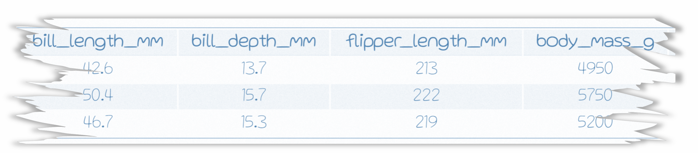

<style>
h1 .header-section-number {background: #031718;}
hr {background:  white;}
</style>


<link rel="stylesheet" 
href="https://cdnjs.cloudflare.com/ajax/libs/font-awesome/6.4.2/css/all.min.css">

```{r setup, include=FALSE}
knitr::opts_chunk$set(echo=TRUE, error=F, warning=F, color=NULL, message=FALSE, eval=F)

xaringanExtra::use_clipboard()
htmltools::tagList(rmarkdown::html_dependency_font_awesome())
```

<br>


# <i class="fa fa-video-camera"></i> <span style="font-size: 90%"> [ggplot: A grammar of graphics](videos/day3/03-1-ggplot.html)


How to create a beautiful ~~plot~~ masterpiece - in 4 steps. 


## 1. Load some data {-}

> We stumbled upon a torn page from a field notebook with a few penguin observations. The only problem is the species and island information is torn off. Let's use graphicial analysis to fill in the gaps for these lost penguins.



```{r, eval=T}
library(tidyverse)

url <- "https://tidy-mn.github.io/R-camp-penguins/data/torn_penguins.csv"

lost_penguins <- read_csv(url)
```


## 2. Start a blank canvas {-}

```{r, eval=T}
ggplot(lost_penguins)

```


## 3. Add aesthetics with `aes()` {-}

Assign the **X** and **Y** axes inside the aesthetics.


```{r, eval=T}
ggplot(lost_penguins, 
       aes(x = bill_length_mm, 
           y = flipper_length_mm))

```


## 4. Add  `geom_*()`'s {-}

Let's start with `geom_point()`. This will create a scatterplot comparing the bill length to flipper length of the lost penguins.

> **NOTE**
>
> Use a plus sign (`+`) to add more layers to your ggplot masterpiece. Similar to how the `%>%` chains functions together, the `+` in ggplot stacks on more layers to your plot. If we were to say the `+` out loud, we could read it as *"take my plot and <b>ADD</b> X to it"*.

```{r, eval=T}
ggplot(lost_penguins, 
       aes(x = bill_length_mm, 
           y = flipper_length_mm)) +
  geom_point()

```

<br>

> Increase the size of the points with the argument `size = `. Let's bump the size up to 10.

```{r, eval=T}
ggplot(lost_penguins, 
       aes(x = bill_length_mm, 
           y = flipper_length_mm)) +
  geom_point(size = 10)

```


<br>


Now that we've taken a quick look at the lost penguins, let's bring in the rest of our penguin observations to see if we can determine where they best fit it the overall population. 

**Load the untorn penguins observations**
```{r, eval=T}
url <- "https://tidy-mn.github.io/R-camp-penguins/data/untorn_penguins.csv"

good_penguins <- read_csv(url)
```

<br>

To view all the data in one plot, it helps to get the data into a single table. Let's combine the good penguin data and the lost penguin data into one dataframe with the function `bind_rows()`. We pass this function the name of two dataframes, and then it returns a combined table with the first table's rows appearing on top. Let's call our combined table `"all_penguins"`.

**Combine / stack the two penguin tables with `bind_rows()`**
```{r, eval=T}
all_penguins <- bind_rows(good_penguins, lost_penguins)
```


<br>

> Update our scatterplot to use the `all_penguins` data.

```{r, eval=F}
ggplot(all_penguins, 
       aes(x = bill_length_mm, 
           y = flipper_length_mm)) +
  geom_point(size = 10)

```

Oof! That is a lot of penguins.


<br>

> The `alpha` argument is used to control the transparency of the points. Let's set it to 0.25 (25%) to see if that helps view the data's distribution better. The darker areas will show where there are more overlayed points on the plot, and will indicate that there's a cluster of penguin observations with that combination of bill and flipper length.

```{r, eval=F}
ggplot(all_penguins, 
       aes(x = bill_length_mm, 
           y = flipper_length_mm)) +
  geom_point(size = 10, 
             alpha = 0.25)

```


<br>

> Let's color the points by the `species` column in the data and see if the clusters are related to penguin species. We can bump up the alpha value to better see the individual "missing" species penguins.

```{r, eval=F}
ggplot(all_penguins, 
       aes(x = bill_length_mm, 
           y = flipper_length_mm)) +
  geom_point(aes(color = species),
             size = 10, 
             alpha = 0.45)

```

Looks like the clusters are species related! And even better news, our lost penguins appear to all be chilling up top with the Gentoo cluster.


<br>

> As another visual check for the "missing" penguin species, let's set the X-axis to the `species` column to more clearly see how the flippers length of our lost penguins stack up against each of the three species.

```{r, eval=F}
ggplot(all_penguins, 
       aes(x = species, 
           y = flipper_length_mm)) +
  geom_point(aes(color = species),
             size = 10, 
             alpha = 0.45)

```

Well then. It certainly looks like our lost penguins have flippers most similar to the Gentoo species.


## A `geom_*` for every occasion {-}

View the full list of geoms in the [*ggplot cheatsheet*](https://rstudio.github.io/cheatsheets/data-visualization.pdf).


## `geom_text()`

Let's use `geom_text()` to add a layer that makes the species clusters in our plot easier to pick out. It's good practice to use something other than color changes to convey important information in your plots.


<br>

> The `label = ` argument inside the aes of `geom_text(aes())` is used to a. Remember the `+` sign!

```{r, eval=F}
ggplot(all_penguins, 
       aes(x = bill_length_mm, 
           y = flipper_length_mm)) +
  geom_point(aes(color = species),
             size = 10, 
             alpha = 0.45) +
  geom_text(aes(label = species)) 

```


Now, that's a bit too busy to pick out where the missing species penguins are. I wonder if there is a way to zoom in on them in the chart?


## `lims()`

The `lims()` or limits function is used to set the boundaries of the X and Y axes. This can be helpful to zoom in on an area, or to force multiple charts to have the same axes range regardless of their values. Let's use `lims()` to zoom in on the upper right portion of our chart. We can set the X-axis to focus on the upper range of bill lengths, let's say *(40, 55)*, and set the Y-axis limit to focus on the upper range of flipper lengths, say *(200, 225)*.


<br>

> The X and Y limit range is placed inside our old friend the `c(min_value, max_value)` vector. The first value will be used for the minimum of the axis and the second value will be used for the maximum.

```{r, eval=F}
ggplot(all_penguins, 
       aes(x = bill_length_mm, 
           y = flipper_length_mm)) +
  geom_point(aes(color = species),
             size = 10, 
             alpha = 0.45) +
  geom_text(aes(label = species)) +
  lims(x = c(40, 55),
       y = c(200, 225))

```


## Island plot

Now let's make an entire new plot that compares bill length and flipper length for each of the islands. Shucks, do we have to start all over? Nope! It's time for some **code magic**.

We can start with the code from our last plot, and simply swap in `island` column for `species`. Voila!

<br>

> Island comparison

```{r, eval=F}
ggplot(all_penguins, 
       aes(x = bill_length_mm, 
           y = flipper_length_mm)) +
  geom_point(aes(color = island),
             size = 10, 
             alpha = 0.45) +
  geom_text(aes(label = island)) +
  lims(x = c(40, 55),
       y = c(200, 225))

```


Now that is a beautiful plot. It sure looks like our lost penguins came from Biscoe island. 

<br>

> Good work! The lost penguin saga has come to a close. The three Gentoo penguins from Biscoe island can now safely join the rest of the penguin population.


## ggplot glossary {-}

**Common aesthetics used in `aes()`**

| aes()         | | Description    |
|:--------------| |:---------------|   
| `x = `        | | X-axis values.    |
| `y = `        | | Y-axis values.    | 
| `size = `     | | The size of the point, column or line.    |
| `alpha = `    | | The transparency of the object (0.25 equates to 25%).   |    
| `fill = `     | | The fill color of a column or area (points and lines do not have fill).  |     
| `color = `    | | The color for points and lines, the **outline** color for columns and areas.   |   
| `linetype = ` | | The type of line to use. Examples include `solid`, `dotted`, `dashed` and more.     |
| `shape = `    | | The shape for points. Includes the default solid circle, diamonds, squares and more.   |

<br>

> View more details and the aesthetics used for each geom in the [*ggplot cheatsheet*](https://rstudio.github.io/cheatsheets/data-visualization.pdf).


# <i class="fa fa-video-camera"></i> <span style="font-size: 90%"> ggplot: Facets, colors, and labels

*Coming soon...*


### <i class="fas fa-carrot"> </i> [Jump to the top](../page/day3.html) {-}

<br>
