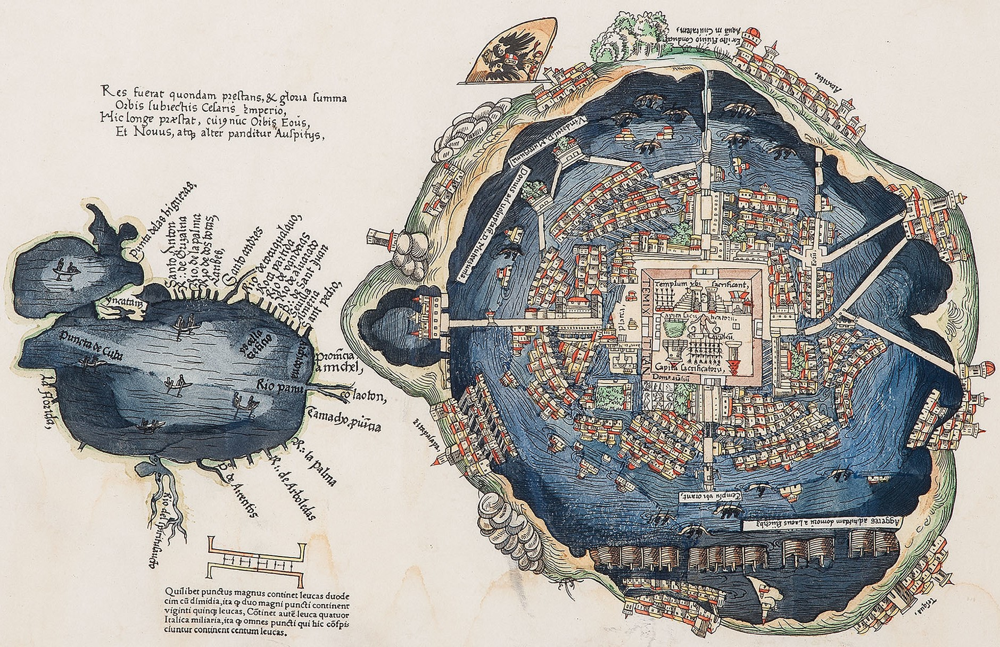

<style>
h1 .header-section-number {background: #62BE2C;}
hr {background: #62BE2C;}
</style>


<link rel="stylesheet" 
href="https://cdnjs.cloudflare.com/ajax/libs/font-awesome/6.4.2/css/all.min.css">

```{r setup, include=FALSE}
knitr::opts_chunk$set(echo=TRUE, error=F, warning=F, color=NULL, message=FALSE)

xaringanExtra::use_clipboard()

htmltools::tagList(rmarkdown::html_dependency_font_awesome())
```

<br>



<p class="caption">Map of Mexico-Tenochtitlan, dated 1524</p>


# <i class="fa fa-video-camera"></i> [Maps: GIS and Coordinate reference systems (CRS)](videos/day4/04-1-maps-gis-crs.html) 

## What is GIS? {-}

GIS stands for: `Geographic Information System`

It is a computer system for capturing, storing, checking, and displaying data related to positions on Earth's surface.

- This is a terrific resource: [National Geopgraphic - GIS](https://education.nationalgeographic.org/resource/geographic-information-system-gis/)
- This is another: [ESRI - What is GIS?](https://www.esri.com/en-us/what-is-gis/overview)


## What is a CRS? {-}

CRS stands for: `Coordinate Reference System`

A coordinate reference system, or CRS, is how spatial data that represent the earth’s **round AND 3-Dimensional** surface are flattened onto a 2 dimensional surface (think of squishing half of a tennis ball flat so that it could be represented on a piece of paper). 

There are Geographic Coordinate Systems which have angular units and are developed from a spheroid representation of the Earth, and a *prime meridian* for reference. There are also projected coordinate systems which have linear units (e.g. feet or meters).

Go through this tutorial to get a better understanding of coordinate reference systems

- [Earth data science](https://www.earthdatascience.org/courses/earth-analytics/spatial-data-r/intro-to-coordinate-reference-systems/)

<br>

> The components of a CRS are:

## 1. Coordinate system {-}


- [Source: What is a coordinate system?](https://www.houseofmath.com/encyclopedia/functions/theory-of-functions/fundamentals-of-functions/what-is-a-coordinate-system)

<br>

## 2. Units of the datum (horizontal and vertical) {-}

A geographic coordinate system, such as the one on the left below, has angular units and defines locations on a sphere. A projected coordinate sytem is flat, and has linear units. If your spatial analysis requires calculating distances in meters, you will want to set your Coordinate Reference System to one that uses meters. UTM stands for Universal Transverse Mercator and is one of the main CRS's you will encounter. UTM contains a series of small projections that minimize the distortion you might see if you use latitude and longitude. 

<br>


- [*Source: ESRI*](https://developers.arcgis.com/python/guide/part1-introduction-what-is-geometry/)
- [Differences in coordinate systems](https://esri.com/arcgis-blog/products/arcgis-pro/mapping/coordinate-systems-difference/)
<br>

## 3. The Datum {-}

Geographic information system datum define the position of the spheroid relative to the center of the earth.


- [*Source: Why we need datums*](https://www.esri.com/news/arcuser/0401/datum.html)

<br>


## 4. Projection information {-}

Again, the projection is a representation of a round surface (the Earth) onto a 2-dimensional flat surface (a map). This involves algorithms that transform each of the Earth's graticules (lines on the earth, latitude and longitude) onto a flat surface. The projection information documents how this was done and what the units of the outcome are.

- This is a great source for [CRS IDs](https://spatialreference.org/ref/epsg/)
- And another resource on [Using projections in R](https://bookdown.org/mcwimberly/gdswr-book/coordinate-reference-systems.html)


# <i class="fa fa-video-camera"></i> [Points, Lines, and Polygons](videos/day4/04-2-points-lines-polygons.html)

- **Points** are simply a pair of geographic coordinates, like a X-Y pair on a plot. They are dimensionless. Examples of point data in GIS are locations of trees in a park, locations where you stopped on a hike, or locations of defibrillators in a building.
- **Lines** are a series of connected points. Examples are depictions of roads, railways, and hiking trails. 
- **Polygons** are a series of lines that connect with area in the middle. Think of lakes, a soccer field, or a county boundary. Sometimes polygons can have holes or spaces in them like a donut. An example is a lake with islands in the middle of it.


A collection of each of these GIS shapes can be stored together as single object. Examples include:

- A collection of points: Every school or hospital
- A collection of lines: Every highway
- A collection of polygons: Every county boundary

<br>


- [*Source: What is geometry?*](https://developers.arcgis.com/python/guide/part1-introduction-what-is-geometry/)


## Rasters {-}

Rasters are continuous data, think of color spectra or the range of moods you may have from very angry to quite happy. You are rarely just one of these and there are infinite gradations depending on how irksome other drivers are or if you got the perfect birthday cupcake.

Rasters come from technologies such as aerial photography and remote sensing imagery. The colors or variations in the cells reflect information like air pollution concentrations or tree canopy cover. 

Rasters are stored in a matrix of cells, like a table and the size of the cell represents the resolution of the information. If the cell is 50m x 50m, then there will be no additional information variation within that size of a cell. If the raster was showing temperature, then their will be a single temperature value for that entire. The smaller the cell size, the greater or finer the resolution of the data.


- [*Source: What is raster data?*](https://desktop.arcgis.com/en/arcmap/latest/manage-data/raster-and-images/what-is-raster-data.htm)


<br>


# <i class="fa fa-video-camera"></i> [**sf** is so awesome](videos/day4/04-3-sf-spatial-analysis-part1.html)


## Spatial analysis with R {-}

A powerful tool in R for spatial analysis and geospatial data is the [sf package](https://r-spatial.github.io/sf/).

{width=30%}


## Reading in data {-}

The main type of data you will be reading in are [shapefiles](https://en.wikipedia.org/wiki/Shapefile). Shapefiles are not one file, but are actually a set of files that include the data, the projection, the coordinates, and information that tells the software the type of data it is. 

The other main type of data you will experience is a flat table of data with X/Y coordinates, like longitude and latitude. This is the type of data we will work with today, but once we set it up as a spatial data set we will save it as a shapefile.

Let's pull in some point data. Each point in this dataset represents a specific tree planted along a street in San Francisco.

> The curious can see more about this dataset at [San Francisco Trees](https://github.com/rfordatascience/tidytuesday/tree/master/data/2020/2020-01-28).


```{r birds-trees, eval=T}
library(sf)
library(tidyverse)

url <- "https://tidy-mn.github.io/R-camp-penguins/data/sf_trees.csv"

sf_trees <- read_csv(url)
```


```{r, echo=F, eval=F}
library(sf)
library(tidyverse)

sf_trees_all <- read_csv("https://raw.githubusercontent.com/rfordatascience/tidytuesday/master/data/2020/2020-01-28/sf_trees.csv")

set.seed(50)

sf_trees <- sample_n(sf_trees_all, 19298)
```


Now, let's look at the data.

```{r trees-view, eval=F}
View(sf_trees)

class(sf_trees)
```

<br>

The dataframe has latitude and longitude columns containing each point's coordinates, but R does not yet know that this is a geographic data set. 

When we begin with a CSV file of coordinates, we must tell R to convert it to a spatial dataset. This will add a new `geometry` column to the dataframe that will be used for mapping the data. 


```{r error, error=TRUE}
# Error!
sf_trees_geo <- st_as_sf(sf_trees, 
                         coords = c("longitude", "latitude"), 
                         crs = 4269, 
                         remove = FALSE)
```


Drats! R is right again. There are some missing coordinates or NA's in the latitude and longitude columns. If we attempt to convert the missing data to a `geometry` we will get an error for missing coordinates. 

<br>

We need to get rid of the trees or rows in the data with missing coordinates. Here are two ways.
```{r na-filter}
# With filter() and !is.na()
sf_trees <- filter(sf_trees, !is.na(longitude), !is.na(latitude))

# Alternative: drop_na()
## If NA appears in *either* of the columns you provide, the row will be dropped
sf_trees <- drop_na(sf_trees, longitude, latitude)
```

<br>

Now that we have filtered out the missing latitude and longitude values, we can run [st_as_sf()](https://www.rdocumentation.org/packages/sf/versions/1.0-14/topics/st_as_sf) without an error. This function requires the data, the name of the columns that contain the coordinates, and the data's current coordinate reference system. 

> If you include the argument, `remove = FALSE`, the latitude and longitude columns will be retained in addtion to adding a `geometry` column. Otherwise they will be removed as they are combined into the `geometry` column.

```{r trees-geo-na}
sf_trees_geo <- st_as_sf(sf_trees, 
                         coords = c("longitude", "latitude"), 
                         crs = 4269, 
                         remove = FALSE)
```

<br>

To check this worked properly, try making a simple plot of the data using the base R function `plot()`. To start with, we will only map the first column. This is simply to make the plotting faster. Feel free to try plotting all of the attributes and see what happens. 

*Heads up, this may take a few minutes for large datasets like this one.*

> It will be difficult to see what is going on here, since at least one tree is very far away from the rest of the trees. Apparently out in the middle of the ocean. Perhaps it is growing on a ship?

```{r trees-plot}
# Show a single layer
plot(sf_trees_geo[1])
```

```{r trees-plot-all, eval=F}
# Show all the layers
plot(sf_trees_geo)
```


```{r, echo=F, eval=F}
library(leaflet)

leaflet(sf_trees %>% sample_n(2000)) %>%
  addTiles() %>%
  addMarkers(#lat = ~latitude,
             #lng = ~longitude
    )

```

<br>

> Not too impressive, is it?. 
> 
> Since we are only interested in the trees within the City of San Francisco boundaries, let's look at which trees overlap or *intersect* with the City of San Francisco limits. 

<br>

We first need to read in a city spatial dataset. Then we will filter it to only include San Francisco. Finally, we will run the intersection *(within)* function on the trees. 

### 1. City data {-}

The **tigris** package allows us to pull political boundaries, like cities, into R. 

```{r tigris}
library(tigris)

options(tigris_use_cache = TRUE)

cities <- metro_divisions()
```

<br>

### 2. Filter to San Francisco {-} 

We'll use `str_detect()`, which tests whether some given characters occur anywhere in a string of text. 

> **NOTE:** `str_detect` performs the same task as `grepl` in the video, with the benefit of putting the name of the column as the first argument.  


Filtering using [str_detect()](https://stringr.tidyverse.org/reference/str_detect.html) is useful when you aren't sure if San Francisco will be proceeded by "the City of", or some similar but slightly different text. There is an entire [cheatsheet](https://rstudio.github.io/cheatsheets/html/strings.html) for working with strings, so check it out when you need to search for a certain word or manipulate text in some way.


```{r city-filter}
san_fran <- filter(cities, str_detect(NAME, "San Francisco"))

plot(san_fran[1])
```

<br>


### 3. View the coordinate reference system {-} 

To do an intersection or check where things overlap, the two datasets need to be using the same CRS. Let's check.

```{r sf-crs, eval=F}
st_crs(san_fran)

st_crs(sf_trees_geo)
```

> Ooofda. That prints a lot of information. The important part is that their last line showing their EPSG ID as `4269` id identical. We are good to go.

<br>

### 4. Intersects with *(overlaps with or is within)* {-} 

```{r intersects-sf}
trees_in_san_fran <- st_intersection(sf_trees_geo, san_fran)
```

<br>

Now, look at our new data in the environment: `trees_in_san_fran`. You'll see that we filtered out some of the tree records because they didn't intersect with the boundary of the City of San Francisco. The number of rows was reduced from 19,006 to 18,994. 


Take a look at the new tree map.
```{r}
# Plots a single layer
plot(trees_in_san_fran[1])
```

> Aha! Now that looks more like a city.

<br>

## Saving maps: `st_write( )` {-}

Since we are very interested in these trees and know we'll use the data later, let's save this new spatial data set with `st_write()`. 

The first argument in `st_write()` is the name of the data in R we are saving, and the second argument is the file location and name to save to. The **.shp** file ending saves the data as a spatial shapefile. This is a common GIS file format for ESRI users and consists of several files. 

The main files have the following extensions:

- `.prj`: The detailed projection information, such as *Lat/Long* or *UTM*
- `.dbf`: The attribute data, or the columns of data in our dataframe
- `.shp`: The shape information, or the *geometry* column in our dataframe

<br>

> Another common spatial format is **.geojson**, which has the advantage of only being a single file. This makes it easier to share with others and will generally save a bit of storage space.

<br>

Finally, we include `delete_layer = TRUE` to the **st_write** funciton to say it's okay to save over previous versions of the file if it already exist in the folder we are saving to.

```{r save, eval=F}
# Save as a shapefile (multiple files, good for ESRI/ArcGIS)
st_write(trees_in_san_fran, 
         "trees_in_san_fran.shp", 
         delete_layer = TRUE) 

# Save as geojson (single file, good for sharing)
st_write(trees_in_san_fran, 
         "trees_in_san_fran.geojson", 
         delete_layer = TRUE) 
```

<br>


# <i class="fa fa-video-camera"></i> [**sf** spatial analysis (Part 2)](videos/day4/04-4-sf-spatial-analysis-part2.html)

## Buffers: Go beyond the point {-}

Let's draw a buffer around each tree in our filtered data set. In your work you may need to draw buffers around point data either when locations are uncertain to a specific level of precision, or if you want to find how many people live within 5 miles of a school or hospital. 

To draw a buffer we must make sure the coordinates are linear rather than angular. Remember when we talked about coordinate reference systems? Lat/long uses angular coordinates and is not so great for calculating distances between points or for calculating areas of polygons. The Universal Transverse Mercator or UTM system on the other hand has coordinates in meters and is a better fit for calculating surface distances. 


Let's transform the tree coordinates from lat/long to UTM.

> San Francisco is in UTM Zone 10: CRS = 32610.

<br>

```{r trees-buffer2, eval=F}
# Convert CRS from Lat/Long to UTM zone 10 (San Francisco)
trees_in_san_fran <- st_transform(trees_in_san_fran, crs = 32610)

# Add a 1,000 meter (1 KM) buffer around each tree
trees_in_san_fran <- st_buffer(trees_in_san_fran, dist = 1000)

# View the new plot, w/ BIG overlapping circles
plot(trees_in_san_fran[1])
```

<br>


## Going the distance {-}

As a next step, we will calculate the distances between the trees and another location of interest. Let's find which tree is closest to a specific loon floating on Leech Lake all the way over in Minnesota. *You know... as one does.*

Below, we create a dataset with a single point using the coordinates stored as latitude and longitude. This is our **special loon**!

<br>

### 1. Create the loon coordinates {-}
```{r trees-distance}
# Our very exact loon coordinates in MN
loon_lat <- 47.1505

loon_long <- -94.3839

# Add the coords to a dataframe
loon_coords <- data.frame(lake = "Leech Lake",
                          lon = loon_long, 
                          lat = loon_lat)
```


### 2. Convert the dataframe to **sf** spatial object with a projection {-}

> The CRS ID for Lat/Long data is `4269`.

```{r}
loon_mn <- st_as_sf(loon_coords,
                    coords = c("lon", "lat"),
                    crs = 4269)
```

<br>


### 3. Transform the trees to the same CRS {-}

For improved distance calculations we will transform both datasets to the projection: *USA Contiguous Albers Equal Area*. 

To transform from one projection to another we use `st_transform()`, and assign the new projection with the argument `crs = "ESRI:102003"`.


```{r}
loon_mn <- st_transform(loon_mn, crs = "ESRI:102003")
```
 
```{r}
trees_in_san_fran <- st_transform(trees_in_san_fran, crs = "ESRI:102003")
```


<br>


## Calculate the **st_distance( )** {-}

We'll use the `st_distance()` function to calculate the distance between each of the trees and our loon. 
```{r}
tree_distances <- trees_in_san_fran %>% 
                  mutate(distance_to_loon_m = st_distance(geometry, loon_mn))
```

Let's also add a column with the distance shown in kilometers by dividing the calculated distance by 1,000 meters. 

> The `as.numeric()` is added below to remove the *meters* units from the original distance value.

```{r}
tree_distances <- tree_distances %>%
                  mutate(distance_to_loon_km = as.numeric(distance_to_loon_m) / 1000)
```

<br>

To determine the closest tree in San Francisco to our loon, let's run *min()* on the column `distance_to_leech_km`, and use `filter()` to keep the only row where its distance is equal to the minimum distance.

```{r distance-min}
closest_tree <- tree_distances %>% 
                filter(distance_to_loon_km == min(distance_to_loon_km))

glimpse(closest_tree)
```


<br>

> **That's our tree!** Number `256051`. The wonderful bark shedding *Platanus x hispanica*, also known as the London plane tree. And good news, it is only ~2,500 kilometers away.


<br>


Pssst... for the extra curious bees in the room. Here is where the tree is in San Francisco. It looks to be planted along The Embarcadero near little Rincon Park.
```{r leaflet-install, eval=F}
install.packages(leaflet)
```

```{r leaflet-plot, eval=T}
library(leaflet)

# Transform the closest tree back to Lat/Long 
closest_tree <- st_transform(closest_tree, crs = 4326)

# Add it to a leaflet map along with ALL the trees
leaflet(trees_in_san_fran) %>%
  addTiles() %>%
  addCircles(lat = ~latitude, 
             lng = ~longitude,
             color = "darkgreen") %>%
  addMarkers(data = closest_tree,
             lat = ~latitude,
             lng = ~longitude) 
```


### <i class="fas fa-carrot"></i> [Jump to the top](../page/day4.html) {-}

<br>
