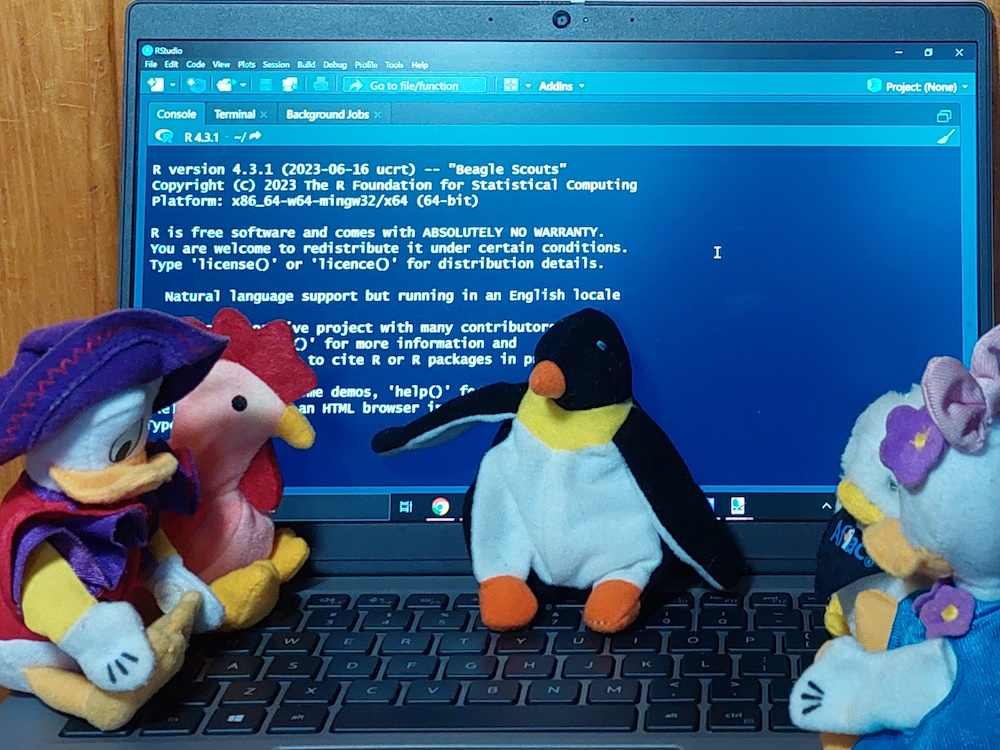
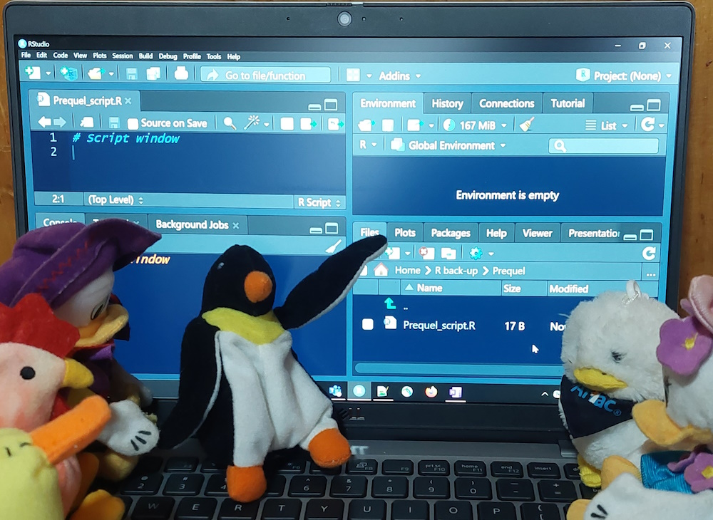
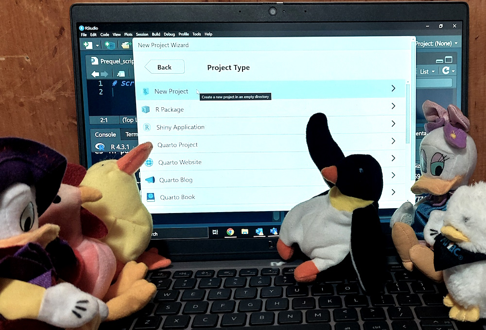
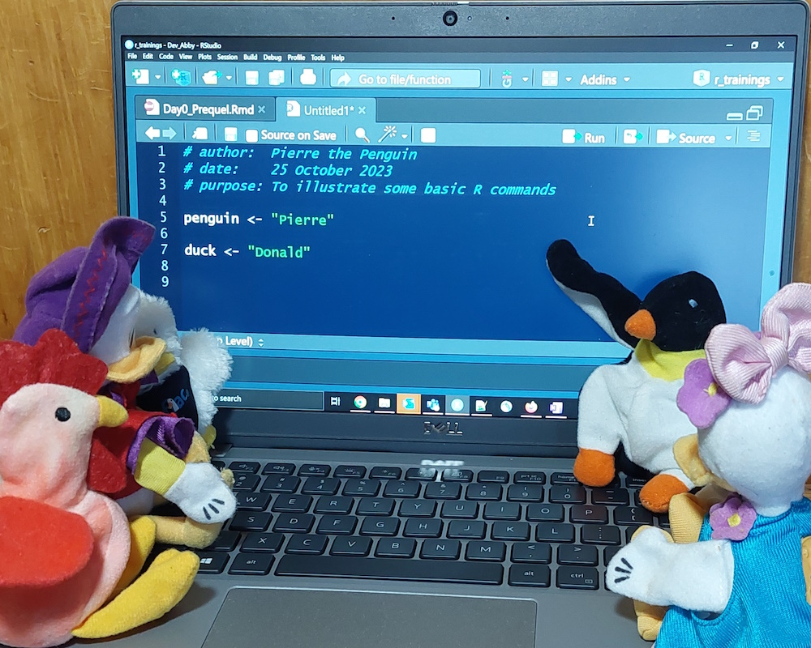
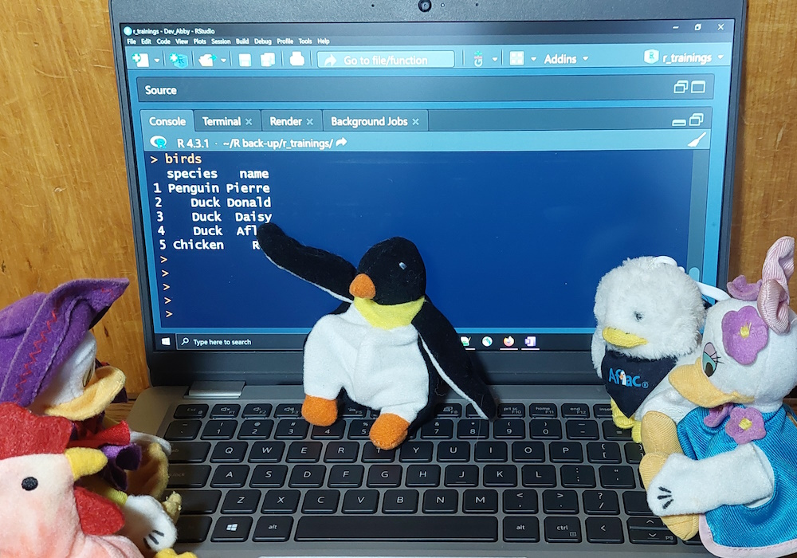

```{r setup, include=FALSE}
knitr::opts_chunk$set(echo = TRUE)
```

# Introduction 

This workshop will take you through the basics of navigating RStudio and using R. You will learn the following content:

* How to name R objects.
* How to create an object in R and use a function on it.
* How to access a built-in R dataset and read a CSV file into R, both from your computer and from the internet.
* How to explore a dataset in R.
* How to access specific variables in a dataset and specific values in a named table.

This workshop will not cover how to manipulate datasets or create new variables. You will cover those in the next workshop. 

The goal today is for you to become comfortable with RStudio, writing simple code, and making mistakes. You will make a lot of mistakes, but R's warning and error systems should help with many of them. After all, you need to break some eggs to make meringue, and much like when making meringue, sometimes you mess up and need to start over.


```{r, out.width = "90%", fig.cap = "Pierre describes R to the poultry", echo = FALSE, fig.alt = "Photograph of Pierre the plush penguin pointing to RStudio on his laptop while his plush poultry friends watch"}

```


# Installing R and RStudio

Don't have R yet? Installation instructions are outlined [HERE](install.html).


# RStudio tour

RStudio is a wrapper or graphic user interface (GUI) that organizes R content to make it easier to use. RStudio also has some options that are not available directly in R. When you first install RStudio, you will see the console window on the left with some text at the top that looks something like this:

```{}
R version 4.3.1 (2023-06-16 ucrt) -- "Beagle Scouts"
Copyright (C) 2023 The R Foundation for Statistical Computing
Platform: x86_64-w64-mingw32/x64 (64-bit)

R is free software and comes with ABSOLUTELY NO WARRANTY.
You are welcome to redistribute it under certain conditions.
Type 'license()' or 'licence()' for distribution details.

  Natural language support but running in an English locale

R is a collaborative project with many contributors.
Type 'contributors()' for more information and
'citation()' on how to cite R or R packages in publications.

Type 'demo()' for some demos, 'help()' for on-line help, or
'help.start()' for an HTML browser interface to help.
Type 'q()' to quit R.
```

Random trivia: All R version names ("Beagle Scouts" above) are taken from the Peanuts comics by Charles Schulz. See a full list of [R version names and origins](https://stackoverflow.com/questions/13478375/is -ther-any-authoritative-documentation-on-r-release-nicknames).

```{r, out.width = "90%", fig.cap = "Pierre explains the parts of RStudio", echo = FALSE, fig.alt = "Photograph of Pierre the plush penguin pointing to a quadrant of RStudio on his laptop while his plush poultry friends watch"}

```


In the console window, the first tab is called "Console". You can type and run code line-by-line here. This is a good way to test correct syntax and trouble-shoot errors. We will not use any other tabs in this window today.

In the upper right window, the first tab is called "Environment". Additional tabs vary depending on your set-up. We will only use the "Environment" window today. This is where your datasets and other objects you create will be listed. At the moment, it should be empty.

In the lower right window, the first tab is "Files". It lists all files in your active directory, which is probably your "Documents" folder right now. We will use this tab in a moment. We may also use the "Plots" tab if time allows after covering the primary material in today's session.

To see the script window, which shows up in the upper left corner, you will need to create a script, which we will do in a moment. You can also view datasets and other files in this window.

There are two settings in RStudio that I find essential when setting up. 

1. To change the font size, click on "View", then either "Zoom In" or "Zoom Out". Alternately, you can click *Ctrl+* (control-plus) or *Ctrl-* (control-minus).
1. To change the color scheme, click on "Tools" > "Global Options" > "Appearance", then select your desired theme. Examples of themes are shown to the right as you select them. My preferred themes are dark with bright colors, like "Cobalt" or "Vibrant Ink". When you find a theme *you* like, select it and click "OK". 


<!-- 
add pic of pierre showing off rstudio windows

can I point to Dorian's video/description instead of reinventing it? 
I like some of his material better than Andy's 
-->

# Creating a project

RStudio gives us the ability to create self-contained projects. For this workshop, we will create and work in a basic project. Here are a few reasons to use projects.

1. In projects R understands relative paths, so you do not need to type the full file path to load or save a file. For example, a full file path might be "C:/Users/HennyPenny/Rprojects/Primer/R/myfile.R", but in the "Primer" project, the relative file path would be "R/myfile.R", which is a lot shorter and easier to write. 
1. The "Files" tab in the lower right window will automatically show the files in the project, even if you move the project somewhere else on your computer.
1. If you save your files to a project, they are easy to find and reference when you need them.
1. If you share your project with a friend, that friend can run the script in the project and it will know to look inside the project folder for everything it needs, even though it is now on your friend's computer.

To create a new project, click on the "File" menu in the upper left, then click on "New Project ...". In the pop-up dialog, click "New Directory", then "New Project". As you become more experienced with R, you will learn about the other kinds of projects. 

For "Directory name:", put your project name. This can be anything, but I suggest something informative like "MDH_R_Primer_2023". I will talk about naming conventions in a moment, but in brief, R sometimes has issues reading file paths that contain periods, spaces, and hyphens, so I prefer to avoid using them. In general, I place underscores instead of spaces between words and try to keep project names relatively short.

For "Create project as a subdirectory of:", I suggest placing the project in your "Documents" folder so you can find it easily. Remember R projects can be moved if you want to put it elsewhere later. I suggest not clicking the checkboxes right now. These are advanced options for version control that you won't need to use today. When you are done, click "Create Project".

```{r, out.width = "90%", fig.cap = "Pierre describes how to create a new project", echo = FALSE, fig.alt = "Photograph of Pierre the plush penguin pointing to the new project dialog in RStudio on his laptop while his plush poultry friends watch"}

```


## R project structure

In the lower right corner of your project, click the "New Folder" icon to create a folder called "Raw_data". You will read data from this folder that you want to import into R, so save any datasets you want to read in here. Create a second folder called "Processed_data". You will save new datasets created in R to this folder. Create a third folder called "R". You can save your R scripts here.

This is one basic folder structure for your project, but it is not the only one possible. As you use R more yourself, you can experiment to figure out which structure works best for you.

To find your project's folder in your file manager, enter this code in the console window. You can navigate to this folder in your file manager to place your data files there.

```{r, eval = FALSE}
# get working directory
getwd()
```

If you want to work out of another folder, for example a shared folder containing your data, you can use the command `setwd()` with the directory path between the parentheses.

A warning when working with Windows file paths in R: Windows uses backslashes between folders. In R, backslashes are special characters, so file paths use forward slashes instead. If you copy a file path from File Explorer, you will need to manually change the backslashes to forward slashes. Don't worry; if you forget or miss a backslash, R will give you an error to remind you.

## Errors, warnings, and messages

It's okay if you make mistakes in your code. R will give you a message to help you fix your mistake. Messages can be in the form of "Message:", "Warning:", and "Error:". 

* **Messages** provide information about what R did and the assumptions it made. Your code will run anyway.
* **Warnings** provide information about possible issues with your code or data. Your code will run anyway, but may give unexpected or undesired results.
* **Errors** provide information about where your code broke. Your code will not run or will stop in the middle.

You might manage to crash R entirely. In my experience, R can crash if you use too much memory or if you try to load an incompatible package. We won't be using that much memory or discussing packages today, so you shouldn't need to worry about those yet. Even if you do crash R, it's fine; just restart RStudio and pick up where you last saved.

On that note, save often!


# Creating an R script

Before you begin coding, you will need to create a new R script. In the upper left corner of RStudio, you can either click the "New File" button (the white rectangle with a green cross button over it) or click "File" > "New File" > "R Script".

The first thing I like to do in a new script is write a header so I can remember in three or six or twelve months what my script is supposed to do. I include my name (and any other coders who worked with me), the date or date range the code was written, and a few lines about what the script is meant to do. I may also include issues I encounter while writing and will want to remember to revisit later.

Here is a simple example of a script header, but feel free to be as fancy as you want. Note that the pound or hash sign, `#`, is placed in front of any code I want to comment out. R will ignore all code after a pound sign and jump to the next line.

```{}
# author: Abby Stamm
# date: 27 November 2023
# purpose: to practice R code in the MDH R primer workshop
```

Throughout this session, I will provide comments with the code to provide you with guidance and context. I encourage you to include additional comments that will help you to learn and understand R better. 

For the remainder of this session, include all of your code in the script you just created. Save often! 

At the end of the session, save your script so you can refer back to it later and remember what you accomplished. Also, saving allows you to build off of and improve your code as you learn more, and share your code with others.

```{r, out.width = "90%", fig.cap = "Pierre demonstrates a basic R script header", echo = FALSE, fig.alt = "Photograph of Pierre the plush penguin pointing to an R script header in RStudio on his laptop while his plush poultry friemds watch"}

```


# Finding files

<!-- 
video with a lot of this exposition
suggest people pause at specific points to try it themselves
exclude from workshop itself or just cover briefly with Q&A?
-->

When you first open RStudio, by default it opens to the state in which it closed. This means if you were not in a project when you closed it, you will not be in one when you open it and if you were in a project when you closed it, you will be in the same project when you open it.

If you are working in multiple projects, a quick way to switch between them is to go to "File", then "Recent Projects ⏵", and select the project you want to open.

# R syntax


<!-- 
video based on sections of "hello world" slideshow
include link to Andy's full slideshow for more info? or just cite it?
create slide deck just for content in video
-->


<!-- 
basic code structure
explanation of object oriented language
data types, vectors, assignments
-->

R is an object-oriented language. This means you begin with an object and perform actions on that object. There are several types of objects in R, but today we will cover just two, numeric and character.


The theme for these workshops is supposed to be penguins, but I grew up on a chicken farm, not a penguin farm. Today, we will be using chickens for our examples.

## Object naming

We will begin with some rules to keep in mind when naming objects. Refer back to this list as needed.

* Names should start with a letter, except in rare exceptions.
* Names can contain letters, numbers, underscores (_), and periods (.). I prefer to avoid using periods in names because they are special characters in R for text manipulation and analysis.
* In R, common ways to separate words in names are with underscores (fave_chicken) and camel case (FaveChicken). Use whichever you prefer, but be consistent. Older functions will also use periods, but most newer code avoids them.
* To make code easier to write and read, keep names short (under 16 characters if possible), but informative.
* Object and function names are case sensitive, so pay attention to your capital letters. FaveChicken, FAVECHICKEN, and favechicken would all be different objects in R.


## Numeric objects


A numeric object is any number. Type the number of chicken dishes you know how to cook into your script. Highlight your number and press "Run" in the upper right corner of the script window.

```{}
# number of chicken dishes I can cook
0 
# output:
[1] 0
```

The output is an object with the value 0, because I don't know how to cook chicken. I liked my chickens too much to eat them!

If we want to use that value in the future, we should save it in our environment. To save an object, assign it to a name using the assignment operator, `<-`. Then it will be listed in our environment window in the upper right corner of RStudio. 

Remember to check the [object naming] guidelines above when choosing object names!

Create the objects `dishes_can_cook` and `dishes_to_learn`. Check whether they show up in your environment window.

```{r, eval = FALSE}
dishes_can_cook <- 0 # change to the number you can cook
dishes_to_learn <- 2.5 # change to the number you want to learn
```

After learning your new dishes, how many will you know how to cook?  

A quick note on running scripts in RStudio: After adding the lines above to your script, you can run it a few different ways. You can run each line by placing the cursor anywhere on the line and either clicking "Run" in the upper right corner of the script window or pressing *CtrlEnter* (control-enter). You can run multiple lines by highlighting them and clicking "run" or pressing *CtrlEnter*. Be careful when highlighting code to run it, though. Only the characters highlighted will be run, even if the highlighting starts in the middle of the line!


R recognizes basic arithmetic calculations, including +, -, *, /, parentheses, and ^ (exponent). In fact, when I started learning R, someone told me, "Any time you need to do any calculations, do it in R to help you get used to the interface and syntax."

Try the following code:
```{r, eval = FALSE}
# total number of chicken recipes I'd like to know
dishes_can_cook + dishes_to_learn
```

If you want to save your result as a new object, remember to assign a name to it.

```{r, eval = FALSE}
total_recipes <- dishes_can_cook + dishes_to_learn
```

How many total recipes will you know how to cook? Is that achievable?


## Character objects


Now that we have seen numeric objects, what about character objects?

Think of your favorite fictional chicken. Type its name into the console. Here's what happened when I tried to enter two fictional chickens.

```{r, eval = FALSE}
Henny Penny # The European equivalent of Chicken Little
# output:
Error: unexpected symbol in "Henny Penny"

Fjalar # the rooster that heralds Ragnarok
# output:
Error: object 'Fjalar' not found
```

What happened? For Henny Penny, I put two words with a space between them. R printed the "unexpected symbol" warning because it was looking for a way to process the two words, like when we added `dishes_can_cook` and `dishes_to_learn`. For Fjalar, I only put one word, but R expected it to be a defined object like `dishes_can_cook`. When R could not find an object called `Fjalar` in the working environment, it printed the error.

How can I fix my errors? 

To enter a text value into R, you need to create a string by wrapping the text value in quotes (single or double). Note that "Fjalar" and 'Fjalar' are equivalent, but if my favorite chicken is Fjalar's son, I would use double quotes ("Fjalar's son") so R knows the apostrophe is part of the string. Try saving your chicken's name to the object `fave_chicken`. Remember to use quotes.

```{r, eval = FALSE}
fave_chicken <- "Henny Penny"
```

Now try saving your favorite chicken's mom to `fave_chicken`. Did it work?

You can also combine strings. Remember R is an object oriented language. This means you create objects, then you perform actions on the objects. You have already seen how to add numeric objects together, but symbols like `+` will not work on strings. Instead, we will use the function `paste()`, which concatenates two strings.

To learn more about any function built into R, we can use the help function. The help function can be accessed two ways, with a question mark at the beginning of the function (`?paste`) or by wrapping the help function around the function we are asking about (`help(paste)` or `help("paste")`). If you are feeling meta, try asking for help on the function `help()`.

Try using `paste()` in the example below. Then try it with your favorite chicken's name. If your favorite chicken doesn't have a last name, make one up.

```{r, eval = FALSE}
# chicken's first and last names
first_name <- "Henny"
last_name <- "Penny"
# chicken's full name
full_name <- paste(first_name, last_name)
# print chicken's full name
full_name

# output: 
[1] "Henny Penny"
```

Did you get the result you expected?


# Using existing data in R

There are several datasets built into R, which you can list or access by running the code `data()`. Today we will explore the ChickWeight dataset. To use this dataset, first we have to load it into our environment using the function `data()`.

```{r, eval = FALSE}
data("ChickWeight")
```

We are going to walk through several functions we can use to explore our dataset. Often we will want to check the types of data in our datasets and see a sample of the results.


The function `str()` will list the variables in our dataset along with variable type and a few values for each. This function displays the structure of your dataset. It provides a snapshot of the type of data in each variable. In the print-out, "int" means integer, "num" means numeric, "chr" means character, "Factor" means categories, and "Ord.factor" means ranked or ordered categories. Try it now.


```{r, eval = FALSE}
# list the dataset variables
str(ChickWeight)
```

What kinds of variables are in this dataset?


The function `head()` will display the first six rows of our dataset and the function `tail()` will display the last six rows. This is a good way to check if your data were read in correctly. Try them now.

```{r, eval = FALSE}
# display the first six rows of data
head(ChickWeight)
# display the last six rows of data
tail(ChickWeight)
```

Here is a list of a few other data exploration functions you can try now on your dataset.

* `dim()` gives a vector of two numbers. The first number is the number of rows or observations. The second number is the number of columns or variables. These number will match the numbers in your environment window.
* `names()` and `colnames()` give a vector of the variable names in your dataset.
* `summary()` gives some information about each variable in your dataset. For numeric variables, it provides statistics like mean and range. For non-numeric variables, it provides counts of values.
* In RStudio, `View()` displays your full dataset as a table in the script window.

Which functions do you find most useful? Which are the most confusing?

```{r, out.width = "90%", fig.cap = "Pierre displays a basic table in R", echo = FALSE, fig.alt = "Photograph of Pierre the plush penguin pointing to the class list for his course in RStudio on his laptop while his plush poultry friends watch"}

```


# Importing and exporting data

R is designed to read in data from elsewhere so we can do things with it, then export the results. In this section, you will learn how to read in (import) and save (export) comma-separated value text file (CSV).

As you learn more R, you will learn ways to read from and save to Excel, shape files, PDF, and many other file formats.


## Reading in data


There are normally two ways you can read a dataset into R. 

1. Read a file you saved in the "Raw_data" folder. 
2. Read a file directly from the internet or another folder. Note that firewall issues and website or folder permissions may prevent this option.

To practice, I wanted to use a chicken dataset, but the USDA poultry data are all for meat instead of live animals. Instead, we will be reading in a dataset of animal welfare complaints in New York City. This dataset is publicly available at https://data.cityofnewyork.us/Environment/Urban-Park-Ranger-Animal-Condition-Response/fuhs-xmg2.


Click the link https://data.cityofnewyork.us/api/views/fuhs-xmg2/rows.csv to save the dataset to your computer. You will probably find it in your "Downloads" (or equivalent) folder. Move it to your "Raw_data" folder.

If you do not recall where you created your project, enter this code in RStudio:

```{r, eval = FALSE}
# get working directory
getwd()
```

After moving your file, return to RStudio. In the lower right window, click on "Files", then on the folder "Raw_data". You should see your file there. Now try reading the file into R.

The code below shows two options to read in your data. Try both. Are both files the same dimensions? Do they have the same variable names and first few rows?

```{r, eval = FALSE}
# read from your project folder 
raw_file <- read.csv("Raw_data/Urban_Park_Ranger_Animal_Condition_Response.csv")

# read from a website
raw_web <- read.csv("https://data.cityofnewyork.us/api/views/fuhs-xmg2/rows.csv")

```

To check and compare your two objects, recall that you can run the following functions on them.

* `str()` gives the structure of your dataset. 
* `dim()` gives the dimensions of your dataset. 
* `head()` and `tail()` show the first and last six rows of your dataset, respectively. 
* `names()` and `colnames()` list the variable names in your dataset.
* `summary()` gives some information about each variable in your dataset.
* `View()` to see your full dataset.

So far, we have been performing functions on the full dataset. This time, we need to perform the function on a specific variable in the dataset. Let's find out how many animal welfare complaints were made about chickens. In this case, you are interested in the "Species.Description" variable. 

To use a specific variable in a dataset, you use the syntax `dataset$variable`, with the `$` symbol telling R to check in the dataset for the variable. If you forget, that's okay. The error R prints out will remind you. 

First, print out the "Species.Description" variable. 

```{r, eval = FALSE}
raw_file$Species.Description
```

That is a lot of species in no particular order. If there are too many values, R will print a warning that the printed data were truncated, so you will not be able to view all of them anyway. 

The easiest way to explore the full data for this variable is to use the function `table()`, which gives you the frequency of a value in a variable. Try running the code below.

```{r, eval = FALSE}
table(raw_file$Species.Description)

```


That is a long table. If you do not want to hunt through the table, you can assign the table to an object, then check the count for "Chicken". To check only the "Chicken" value, you will need to index it. To index in R, use square brackets (`[]`) as shown below.

```{r, eval = FALSE}
# save the table of all species counts
species <- table(raw_file$Species.Description)

# print only the count for Chicken from the table
species["Chicken"]
```

Modify the code above to check counts for "Cattle", "Bottlenose Dolphin", and "Raccoon".

Which species of these three species had the most complaints? Did any have more complaints than chickens? Did any of them surprise you?


## Saving or exporting data from R

The easiest place to save data is inside your project. The code below saves your dataset to your "Processed_data" folder as a CSV.

```{r, eval = FALSE}
# write the dataset you created
write.csv(raw_file, file = "Processed_data/nyc_animal_welfare_complaints.csv")
```


Save your script (if you have not already) in your "R" folder.


# Bonus content: plots

This is a basic introduction to simple R plots. There are several kinds of plots built into base R.

* `boxplot()` draws a box plot of a numeric variable.
* `plot()` draws a scatter plot of two numeric variables.
* `hist()` draws a histogram of a numeric variable.
* `barplot()` draws a bar plot based on a frequency table.
* `pie()` is not popular among R users, but I am including it here for completeness. It draws a pie chart based on a frequency table.

For the examples below, we will use the following variables from our "raw_file" dataset.

* "Duration.of.Response" (numeric): how long responders were present, in minutes
* "X..of.Animals" (numeric): number of animals involved in the incident
* "Hours.spent.monitoring" (numeric): post-response time animals were monitored, in hours
* "Animal.Condition" (categorical): condition in which the animals were found

## Box plot

The box plot (or box-and-whiskers plot) is the simplest of the listed plots. Any of the numeric variables would work here, so pick your favorite.

```{r, eval = FALSE}
# draw a box plot of duration of response in minutes
boxplot(raw_file$Duration.of.Response)
```

If we want to get more creative, we can include two variables. In this case, I would like to see if animal condition affects duration of response. I think worse off animals will require longer response times. To add the new variable, we use a tilde (`~`) to denote response time is dependent on animal condition.

```{r, eval = FALSE}
# draw a box plot of duration of response dependent on animal condition
boxplot(raw_file$Duration.of.Response ~ raw_file$Animal.Condition)
```

This code creates a row of side-by-side box plots, but they are smooshed at the bottom and hard to read. Fortunately, most R functions include options that affect how the functions work. The functions `boxplot()` and `barplot()` include the option "horizontal", which defaults to FALSE. Try changing it to TRUE as shown below.

```{r, eval = FALSE}
# draw a horizontal box plot of duration of response dependent on animal condition
boxplot(raw_file$Duration.of.Response ~ raw_file$Animal.Condition, horizontal=TRUE)
```

That outlier around 75 minutes is still throwing things off and you may need to increase your plot size to see all the labels, but at least the box plots themselves are easier to see now. Do you see any patterns? Was my hypothesis correct?


## Scatter plot

The function `plot()` is a generic plot function that works well for a variety of plot types. In its simplest form, it can be used for scatter plots. Try drawing a scatter plot of duration of response by the number of animals.

```{r, eval = FALSE}
# draw a scatter plot of duration of response by number of animals
plot(raw_file$Duration.of.Response, raw_file$X..of.Animals)
```

Remember the options I mentioned above? We can also add options to our scatter plot. Let's add a title and axis labels. To add a title, use the option "main" and to add axis labels, use "xlab" and "ylab" for your x and y axes, respectively. The options "xlab" and "ylab" default to the variable names, so these will be overwritten. These labeling options work for most of the plots in this section, so on your own, try adding them to your box plot above.

```{r, eval = FALSE}
# draw a scatter plot of duration of response by number of animals
plot(raw_file$Duration.of.Response, raw_file$X..of.Animals,
     main = "Scatter plot of duration of response by number of animals",
     xlab = "duration in minutes", ylab = "number of animals")
```

*Suggestion: highlight all three lines above in your script and run them together.*

Does there appear to be an association between duration of response and number of animals?


## Histogram

Next, let's plot a histogram of "Hours.spent.monitoring" using the `hist()` function. This function draws the shape of a numeric variable, for example to visualize whether it is normal (bell curved) or skewed (with a tail). 

```{r, eval = FALSE}
# draw a histogram of number of hours the animals were monitored 
hist(raw_file$Hours.spent.monitoring)
```

Does the histogram look normally shaped?

On your own, draw another histogram for the duration of response. Well, that looks uninformative. Let's add a few more bars to see what we are dealing with. You can do this using the "breaks" option as shown below. 

```{r, eval = FALSE}
# draw a histogram of number of hours the animals were monitored 
hist(raw_file$Duration.of.Response, breaks = 60)
```

What can you conclude from the histogram about how long the response takes?

By the way, the label options introduced above will work for `hist()`, too. Try labeling your histogram on your own.

## Bar chart

Bar charts are drawn using the `barplot()` function. To use this function, we need to create a table first. Try creating a table of animal conditions, the way you did above with animal species. Then use that table in the function, as shown below.

```{r, eval = FALSE}
# create a table of animal conditions
animal_cond <- table(raw_file$Animal.Condition)
# draw a bar plot of animal conditions
barplot(animal_cond)
```

What is the most common animal condition, excluding unknowns?

The option "horizontal" covered under box plots also works for bar charts. The labeling options work, too. Try adding different options on your own.


## Pie chart

Pie charts are basic in R, with a lot less customizability than other chart types. Like bar charts, pie charts require a table of counts. To create a pie chart, use the function `pie()`. Try creating a pie chart using the table of animal conditions you created above.

```{r, eval = FALSE}
# draw a pie chart of animal conditions
pie(animal_cond)
```

Is the bar chart or the pie chart easier for you to understand?

If you are feeling adventurous, try adding the options you learned to your code. Do they work? Do they cause warnings or errors? Do they make your chart more readable?

